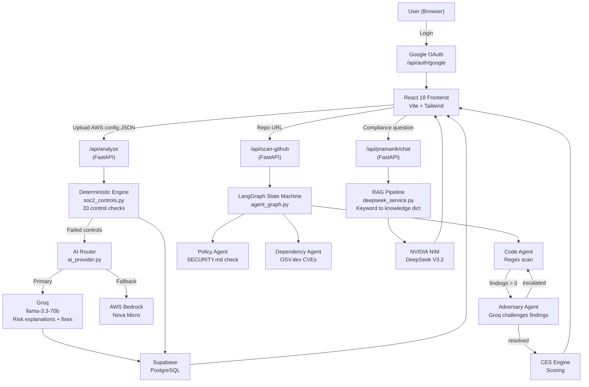

# Pramanik AI : SOC 2 Compliance Co-Pilot

> An AI-powered SOC 2 compliance analyzer for SaaS startups. Upload your AWS configuration, scan live infrastructure or GitHub repositories, and get instant gap analysis, AI-generated remediation steps, policy documents, and adversarial audit simulations — in minutes, not months.

[](https://github.com/Ishaan6286/Pramanik)
[](https://fastapi.tiangolo.com/)
[](https://react.dev/)
[](https://supabase.com/)
[](https://groq.com/)

---

## Overview

SOC 2 Type II compliance is notoriously slow, expensive, and confusing for startups. Security audits require mapping dense AWS configurations to abstract compliance criteria — a process that traditionally takes **months of manual work** and expensive consultants.

**Pramanik AI** automates this. A CTO or DevOps engineer connects their AWS account or GitHub repository. A deterministic Python engine evaluates the infrastructure against all **33 SOC 2 Trust Services Criteria**. Failed controls are sent to LLMs that generate plain-English risk explanations and step-by-step AWS console fixes. The system also generates complete compliance policy documents, simulates adversarial auditor interviews, maps vendor coverage, and produces a personalised certification roadmap.

**Target audience:** CTOs, CISOs, DevOps engineers, and compliance officers at SaaS startups (Seed through Series C) preparing for SOC 2 Type II certification.

---

## Key Features

### Core Analysis
- **AWS Gap Analysis** — Deterministic evaluation of AWS configs against all 33 SOC 2 controls; outputs a compliance score, severity-ranked failures (Critical / High / Medium), and step-by-step AWS console remediation steps
- **Live AWS Scanning** — Connects directly to AWS via `boto3` to pull live infrastructure state
- **GitHub Repository Scanning** — LangGraph multi-agent pipeline scans repos for hardcoded secrets, missing security docs, and vulnerable dependencies (CVE checks via OSV.dev)
- **Compliance Drift Detection** — Compares current configs against stored baselines to surface regressions

### AI Modes (Pramanik AI Co-Pilot)

| Mode | What It Does |
|------|-------------|
| **Gap Analysis** | Score AWS config against 33 SOC 2 controls with AI-enriched explanations |
| **Policy Generator** | Generate 10 types of SOC 2-compliant policy documents tailored to your company & stack |
| **Ghost Audit** | Simulate a Big 4 adversarial auditor; get 10 hard challenge questions |
| **Vendor Inheritance (TrustDNA)** | Map which controls your SaaS vendors (Stripe, AWS, Supabase, etc.) already cover |
| **Breach Analysis** | Check your infrastructure exposure against 5 real-world breach case studies |
| **Certification Pathfinder** | Get a personalised roadmap: Type I vs II, timeline, effort, and priority controls |
| **Compliance Chatbot** | RAG-powered Q&A assistant grounded in the SOC 2 knowledge base |

### Supporting Capabilities
- Export compliance dashboards as **PDF reports** (`html2canvas` + `jspdf`)
- Dark / light mode UI
- Graceful AI fallback chain: Groq → AWS Bedrock → deterministic-only response
- All responses under 500 ms for analysis modes

---

## Tech Stack

| Category | Technologies |
|----------|-------------|
| **Frontend** | React 18, Vite, JavaScript (JSX), Tailwind CSS |
| **Frontend — Animation** | Three.js (`@react-three/fiber`, `@react-three/drei`, `ogl`), GSAP, Framer Motion, Lenis |
| **Frontend — Data** | Recharts, `jspdf`, `html2canvas` |
| **Backend** | FastAPI (Python 3.11), Uvicorn, Pydantic |
| **AI Orchestration** | LangGraph, LangChain-Groq, LangChain-Core |
| **LLM Providers** | Groq (`llama-3.3-70b-versatile`), NVIDIA NIM (`deepseek-ai/deepseek-v3.2`), AWS Bedrock (`amazon.nova-micro-v1:0`) |
| **RAG** | Rule-based keyword retrieval from in-memory SOC 2 knowledge dictionary |
| **Authentication** | Google OAuth 2.0 (`@react-oauth/google`, exchange via `urllib`) |
| **Database** | Supabase (PostgreSQL) |
| **Cloud SDK** | `boto3` (AWS) |
| **Frontend Deployment** | Vercel |
| **Backend Deployment** | Render |

---

## System Architecture



---

## How It Works

### AWS Configuration Analysis (Primary Flow)

1. **User authenticates** via Google OAuth; identity is stored in `localStorage`.
2. **User uploads** an AWS configuration JSON (or connects live AWS).
3. `POST /api/analyze` passes the config to `soc2_controls.py`, which runs **33 independent deterministic check functions** — no AI involved in pass/fail decisions.
4. Failed controls are sent to **Groq** (`llama-3.3-70b-versatile`) with a structured JSON prompt to generate risk explanations, business impact, and step-by-step AWS console fixes.
5. The `calculate_crvs()` function ranks findings by severity.
6. Results are saved to **Supabase** (`scans` table). The config is stored as a baseline for future drift detection.
7. The frontend renders the compliance score, critical gaps, and remediation plan.

### GitHub Repository Scan (LangGraph Flow)

1. User provides a repo URL → `POST /api/scan-github`.
2. A **LangGraph `StateGraph`** runs three agents: Code (regex pattern matching), Policy (checks for `SECURITY.md`), and Dependency (CVE lookup via OSV.dev).
3. If findings exist, a conditional edge routes to the **Adversary Agent**, which uses Groq to challenge the findings.
4. If the Adversary escalates any finding, the graph **loops back** to re-scan flagged files specifically. This cyclic behaviour is the core reason LangGraph was chosen over standard LangChain chains.
5. Final scored state is returned to the frontend.

```
START
  ↓
code_agent (regex file scan)
  ↓
policy_agent (SECURITY.md check)
  ↓
dependency_agent (OSV.dev CVEs)
  ↓
[Conditional: findings > 0?]
  ├── NO  → ces_engine → END
  └── YES → adversary_agent (Groq challenges findings)
                ↓
            [Conditional: findings escalated?]
                ├── YES → increment_iteration → code_agent (deep re-scan)
                └── NO  → ces_engine → END
```

---

## AI / RAG Architecture

### LLM Provider Strategy

| Provider | Model | Role | Why |
|----------|-------|------|-----|
| **Groq** | `llama-3.3-70b-versatile` | Gap explanations, policy generation, adversary agent | Ultra-low LPU latency; generates large JSON for 33 controls without timeout |
| **NVIDIA NIM** | `deepseek-ai/deepseek-v3.2` | RAG chatbot | Superior chain-of-thought reasoning for open-ended compliance Q&A |
| **AWS Bedrock** | `amazon.nova-micro-v1:0` | Fallback / enterprise alternative | Switchable via `AI_PROVIDER` env var; zero external dependencies for AWS-mandated environments |

Temperature is `0.3` for structured JSON output (Groq) and `0.7` for conversational chat (DeepSeek).

### RAG Implementation (`deepseek_service.py`)

> **Note:** This project uses **rule-based context retrieval** — not vector embeddings or a vector database. This was an intentional architectural decision.

The pipeline:
1. **Knowledge Base** — `SOC2_KNOWLEDGE_BASE`: a hardcoded Python dictionary containing all SOC 2 control domains, definitions, and criteria aliases.
2. **Retrieval** — `build_rag_context()` converts the user query to lowercase and checks for keyword/alias matches (`"cc6"`, `"mfa"`, `"cloudtrail"`, etc.).
3. **Context construction** — Matched entries are concatenated into a context string.
4. **Prompt construction:**
   ```
   KNOWLEDGE BASE CONTEXT:
   {rag_context}

   USER QUESTION:
   {user_question}
   ```
5. **Generation** — Sent to DeepSeek V3.2 via OpenAI-compatible SDK at `https://integrate.api.nvidia.com/v1`.
6. **Fallback** — If DeepSeek fails, the same context string is forwarded to `ai_provider` (Groq/Bedrock).

**Why not pgvector?** SOC 2 taxonomy is a fixed, 33-control standard. Keyword mapping achieves 100% precision on control retrieval with zero latency and no infrastructure cost. Vector search would be appropriate if ingesting arbitrary compliance PDFs at scale.

### Deterministic vs. LLM Separation

A critical design principle: **the AI never decides whether a control passes or fails.** `soc2_controls.py` contains pure Python logic (e.g., `if config.get("mfa_enforced") != True → FAIL CC6.1`). LLMs are only used downstream to *explain* proven failures and generate remediation text. This eliminates hallucination from the compliance scoring entirely.

### Reliability & Fallbacks

- **Retry logic** — `ai_provider.py` wraps LLM calls with exponential backoff (`(attempt + 1) × 1.5s`).
- **Graceful degradation** — If Groq fails completely, `main.py` catches the exception and returns the deterministic scan results without AI explanations. Users are never blocked.
- **Database failure isolation** — Supabase writes are wrapped in `try/except`; a DB outage does not block the API response.

---

## Project Structure

```
Pramanik/
└── soc2-analyzer/
    ├── backend/
    │   ├── main.py               # FastAPI entrypoint; routes, auth handlers, CORS
    │   ├── soc2_controls.py      # Deterministic SOC 2 evaluation engine (33 controls)
    │   ├── ai_provider.py        # Abstract LLM router (Groq ↔ Bedrock) + retry logic
    │   ├── groq_service.py       # Groq integration: gap explanations, policies
    │   ├── deepseek_service.py   # DeepSeek RAG chatbot implementation
    │   ├── bedrock_service.py    # AWS Bedrock fallback integration
    │   ├── agent_graph.py        # LangGraph multi-agent state machine (GitHub scan)
    │   ├── github_agent.py       # GitHub repo scanner (regex + CVE checks)
    │   ├── adversary_agent.py    # AI auditor: challenges and escalates findings
    │   ├── pramanik_ai.py        # Policy generator, breach analysis, pathfinder logic
    │   ├── db.py                 # Supabase database operations
    │   ├── drift_detector.py     # Baseline comparison for compliance drift
    │   └── requirements.txt
    ├── frontend/
    │   └── src/
    │       ├── components/
    │       │   ├── PramanikAI.jsx    # AI Co-Pilot: 7-mode UI
    │       │   └── PramanikAI.css
    │       ├── App.jsx               # Main entry; state-based routing
    │       └── ThemeContext.jsx      # Dark / light mode state
    │   ├── package.json
    │   ├── tailwind.config.js
    │   └── vercel.json               # Vercel deployment config
    ├── render.yaml                   # Render backend deployment config
    ├── PRAMANIK_AI_GUIDE.md
    ├── PRAMANIK_AI_QUICKSTART.md
    └── PRAMANIK_INTERVIEW_MASTER.md
```

---

## Authentication

Authentication uses **Google OAuth 2.0**:

1. The frontend uses `@react-oauth/google` to open a Google sign-in popup.
2. Google returns an authorization `code`.
3. The frontend sends the code to `POST /api/auth/google`.
4. The FastAPI backend exchanges it for an access token using `urllib.request`, then fetches the user profile from `https://www.googleapis.com/oauth2/v3/userinfo`.
5. The backend returns `email`, `name`, and `picture` to the frontend.
6. The frontend stores the user object in `localStorage("pramanik_user")` and updates the app state.

> **Current limitation:** Subsequent API requests do not carry a verified JWT. The `user_id` is sent as part of the request payload. Per-route authorization middleware (FastAPI `Depends(verify_token)`) and Supabase Row Level Security are planned improvements.

---

## Database

**Database:** Supabase (managed PostgreSQL)  
**Client:** `supabase` Python package via REST API

| Table | Purpose |
|-------|---------|
| `scans` | Gap analysis runs: `user_id`, `company_name`, `score`, `results` (JSONB), `config` (JSONB) |
| `baselines` | Known-good infrastructure configurations for drift detection |
| `audit_questions` | Dynamically seeded adversarial audit questions |
| `github_scans` | LangGraph multi-agent run results and findings |

PostgreSQL was chosen over NoSQL because SOC 2 data is relational (users → scans → controls → audit questions), and strict schema integrity matters for a compliance product.

---

## API Overview

All endpoints are served by the FastAPI backend.

| Method | Endpoint | Description |
|--------|----------|-------------|
| `POST` | `/api/analyze` | Deterministic AWS config evaluation + LLM enrichment |
| `POST` | `/api/scan-aws` | Live AWS environment scan via `boto3` |
| `POST` | `/api/scan-github` | LangGraph multi-agent GitHub repository scan |
| `POST` | `/api/pramanik/chat` | RAG-powered DeepSeek compliance chatbot |
| `POST` | `/api/pramanik/gap-analysis` | Pramanik Co-Pilot: gap analysis mode |
| `POST` | `/api/pramanik/policy` | Generate a SOC 2 compliance policy document |
| `POST` | `/api/pramanik/ghost-audit` | Generate adversarial Big 4 auditor questions |
| `POST` | `/api/pramanik/vendor-inheritance` | Map vendor stack to SOC 2 control coverage |
| `POST` | `/api/pramanik/breach-analysis` | Assess exposure against real-world breaches |
| `POST` | `/api/pramanik/certification-path` | Generate personalised certification roadmap |
| `POST` | `/api/auth/google` | Google OAuth code exchange |
| `GET`  | `/api/health` | Health check (used by Render) |

---

## Environment Variables

Configure these in `soc2-analyzer/backend/.env` for local development. On Render, set them as secret environment variables (never commit actual values).

| Variable | Purpose |
|----------|---------|
| `GROQ_API_KEY` | Groq API key (primary LLM for gap analysis, policies, adversary agent) |
| `DEEPSEEK_API_KEY` | NVIDIA NIM API key for DeepSeek V3.2 chatbot |
| `DEEPSEEK_BASE_URL` | NVIDIA NIM base URL |
| `AI_PROVIDER` | Switch between `groq` and `bedrock` for the primary analysis LLM |
| `AWS_ACCESS_KEY_ID` | AWS credentials for Bedrock fallback and live AWS scanning |
| `AWS_SECRET_ACCESS_KEY` | AWS secret key |
| `AWS_REGION` | AWS region (e.g., `ap-south-1`) |
| `SUPABASE_URL` | Supabase project REST URL |
| `SUPABASE_ANON_KEY` | Supabase anon/public key |
| `SUPABASE_SERVICE_KEY` | Supabase service role key (server-side operations) |
| `GOOGLE_CLIENT_ID` | Google OAuth 2.0 client ID |
| `GOOGLE_CLIENT_SECRET` | Google OAuth 2.0 client secret |
| `GITHUB_CLIENT_ID` | GitHub OAuth app client ID |
| `GITHUB_CLIENT_SECRET` | GitHub OAuth app client secret |
| `CORS_ORIGINS` | Comma-separated allowed origins (e.g., your Vercel frontend URL) |

---

## Getting Started

### Prerequisites

- Python 3.11+
- Node.js 18+
- A Supabase project
- Groq API key (free tier available at [console.groq.com](https://console.groq.com))

### 1. Clone the repository

```bash
git clone https://github.com/Ishaan6286/Pramanik.git
cd Pramanik/soc2-analyzer
```

### 2. Set up the backend

```bash
cd backend
python -m venv venv
# Windows:
venv\Scripts\activate
# macOS / Linux:
source venv/bin/activate

pip install -r requirements.txt
```

Create `backend/.env` with the variables listed in the [Environment Variables](#environment-variables) section above.

### 3. Start the backend

```bash
uvicorn main:app --reload --port 8000
# Health check: http://localhost:8000/api/health
```

### 4. Set up and start the frontend

```bash
cd ../frontend
npm install
npm run dev
# App available at: http://localhost:5173
```

### 5. Test an endpoint

```bash
curl -X POST http://localhost:8000/api/pramanik/gap-analysis \
  -H "Content-Type: application/json" \
  -d '{
    "mfa_enforced": false,
    "cloudtrail_enabled": false,
    "s3_public_access": true,
    "rds_encryption": true,
    "tls_enabled": true,
    "security_groups_configured": false,
    "least_privilege_applied": false,
    "cloudwatch_enabled": false
  }'
```

---

## Deployment

| Layer | Platform | Config |
|-------|----------|--------|
| **Frontend** | Vercel | [`frontend/vercel.json`](soc2-analyzer/frontend/vercel.json) — Vite build, SPA rewrites |
| **Backend** | Render (Free tier) | [`render.yaml`](soc2-analyzer/render.yaml) — Python 3.11, Uvicorn start command |

The `render.yaml` configures all required environment variable keys. Secret values (API keys, DB credentials) are set through the Render dashboard and are never committed to the repository.

---

## Security

| Mechanism | Status |
|-----------|--------|
| **CORS** | Configured in `main.py` via `CORS_ORIGINS` env var; only listed origins are permitted |
| **Secret isolation** | All API keys (Groq, Supabase, DeepSeek, AWS) are kept strictly on the backend; never exposed to the frontend |
| **No AI hallucination in scoring** | Pass/fail decisions are fully deterministic; LLMs only generate explanatory text |
| **Error isolation** | AI failures and database failures are caught and do not leak internal details to API consumers |
| **Backend JWT / RLS** | Not yet implemented — planned improvement (see below) |

---

## Future Improvements

- **JWT authentication middleware** — Issue HttpOnly signed JWTs on login and validate on every protected route with FastAPI `Depends(verify_token)`
- **Supabase Row Level Security** — Enforce per-user data isolation at the database layer
- **Async LLM pipeline** — Decouple LLM generation from the HTTP request cycle using Celery + SQS; return deterministic scores immediately and stream AI explanations via WebSocket
- **Vector RAG upgrade** — Chunk SOC 2 PDF manuals, generate embeddings with `text-embedding-3-small`, and store in Supabase pgvector for broader Q&A coverage
- **Real-time AWS Config scanning** — Automate gap analysis using AWS Config rules rather than manual JSON upload
- **PDF export** of full gap analysis reports

---

## Additional Documentation

| Document | Description |
|----------|-------------|
| [`PRAMANIK_AI_QUICKSTART.md`](soc2-analyzer/PRAMANIK_AI_QUICKSTART.md) | Fast setup guide and curl examples for all 7 API modes |
| [`PRAMANIK_AI_GUIDE.md`](soc2-analyzer/PRAMANIK_AI_GUIDE.md) | Deep documentation: all 7 modes with full I/O examples and how to extend the system |
| [`PRAMANIK_INTERVIEW_MASTER.md`](soc2-analyzer/PRAMANIK_INTERVIEW_MASTER.md) | Forensic technical analysis: architecture decisions, LLM choices, LangGraph flow, and interview Q&A |

---

## Author

**Ishaan Pramanik**  
GitHub: [@Ishaan6286](https://github.com/Ishaan6286)  
Repository: [github.com/Ishaan6286/Pramanik](https://github.com/Ishaan6286/Pramanik)

---

*Built for Indian SaaS startups scaling to enterprise customers who require SOC 2 Type II certification.*
